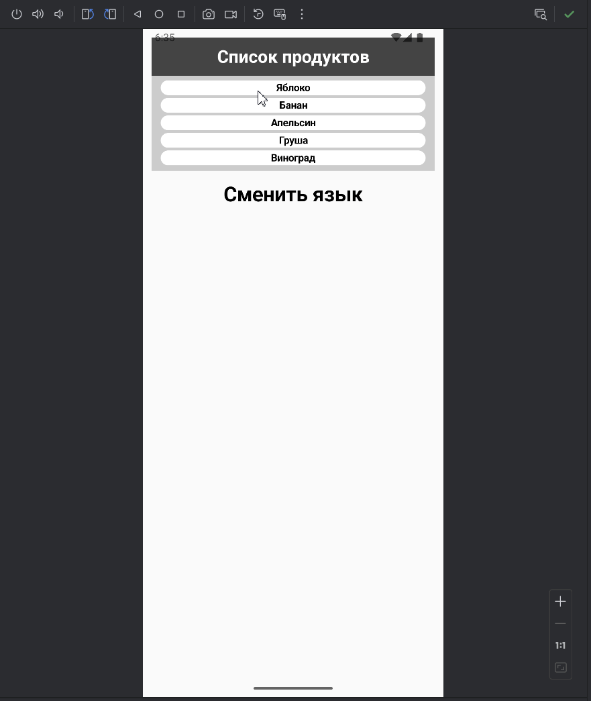

# Приложение «Отдел кадров»

Необходимо написать приложение на основе пройденного материала, содержащее в себе данные о персонале организации. В качестве элемента, располагающего в себе данные, использовать `LazyColumn`.

Имеющийся список персонала содержит в себе объекты класса со свойствами `имени`, `фамилии` и `должности`. Список состоит не менее чем из 24 персон. Штатное расписание должностей можно определить самостоятельно. Список перемешан, элементы располагаются в произвольном порядке.

На экране устройства с имеющейся вертикальной прокруткой при правильной работе приложения мы видим сгруппированный по `должности` вывод персонала под соответствующим заголовком, которые отображаются в отсортированном порядке по `имени`.

Кроме того, функционально организована возможность по нажатию на текстовый элемент «В конец» и «В начало» перейти в конец списка, начало списка соответственно.

## Демонстрация



[//]: # ()


## Установка


Инструкции по установке проекта:

1. Клонируйте репозиторий:

```bash
git clone --branch=Software-scrolling https://github.com/PawPrintsInTheDark/FirstAppJetpackCompose.git

