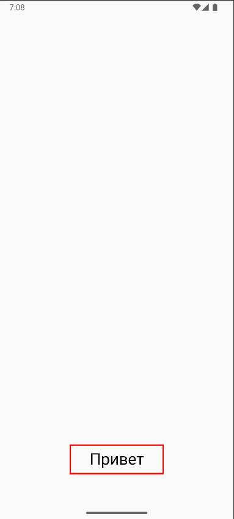
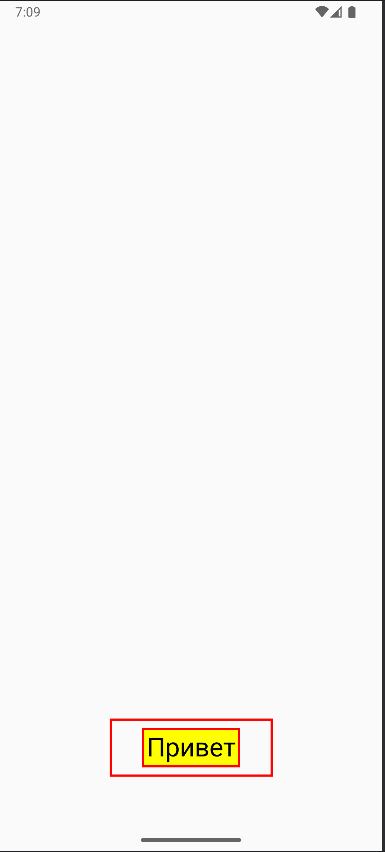
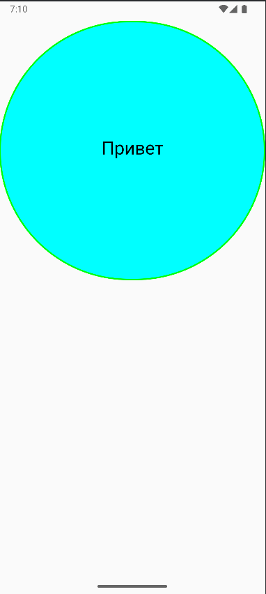

# Приложение «Модификаторы в Jetpack Compose»

Необходимо написать `Composable` – функцию, которая будет выводить текстовое сообщение, передаваемое в параметрах этой функции. Функция должна принимать пустой модификатор и отображать сообщение на экране устройства.

1 часть задания.

Функция может принимать пустой модификатор. При этом экран устройства будет отображать сообщение следующим образом:

- При применении дефолтного модификатора на экране устройства сообщение будет отображаться с базовыми стилями.
- При применении кастомного модификатора на экране устройства сообщение будет отображаться с измененными стилями, которые определяются кастомным модификатором.

2 часть задания.

Функция может принимать модификатор по умолчанию. При этом экран устройства будет отображать сообщение следующим образом:

- При применении дефолтного модификатора на экране устройства сообщение будет отображаться с базовыми стилями.
- При применении кастомного модификатора на экране устройства сообщение будет отображаться с измененными стилями, которые определяются кастомным модификатором.

Для успешного выполнения задания необходимо реализовать логику отображения текста с учетом указанных модификаторов.
## Демонстрация

[//]: # ()








## Установка


Инструкции по установке проекта:

1. Клонируйте репозиторий:

```bash
git clone --branch=Modifier https://github.com/PawPrintsInTheDark/FirstAppJetpackCompose.git

